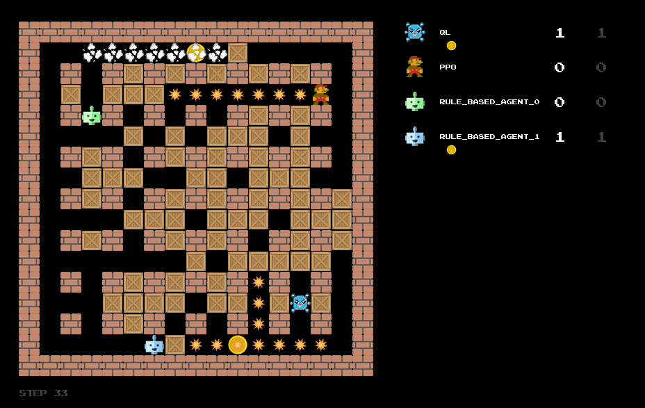

<div align="center">

# Bomberman Reinforcement Learning

</div>
<div align="center">
  
</div>

A project for the course:  
*Reinforcement learning and autonomous agents*  

---

## Introduction
This project explores **Reinforcement Learning (RL)** techniques in the **Bomberman** environment. Our primary goal is to develop an intelligent agent capable of strategic decision-making, optimizing movement, bomb placement, and opponent avoidance.

## Agents Implemented

### 🔹 Nucleus (PPO-Based Agent)
- **Algorithm:** Proximal Policy Optimization (PPO)
- **Status:** Currently being optimized
- **Location:** `agent_code/nucleus`
- **Description:** Nucleus leverages PPO for policy learning. However, performance is still being refined to mitigate suboptimal behaviors like staying idle or failing to escape bomb blasts.

### 🔹 QL_Agent (Q-Learning Baseline)
- **Algorithm:** Q-Learning
- **Status:** Stable performance
- **Location:** `agent_code/ql_agent`
- **Description:** QL_Agent serves as a comparative baseline, utilizing tabular Q-learning to make decisions based on a learned value function.

## Environment Overview

The **Bomberman environment** is a **grid-based game** where agents navigate a map, place bombs, and attempt to maximize their score while avoiding self-destruction. Key mechanics include:

- 🏃 **Movement:** Agents can move in four cardinal directions within a structured grid.
- 💣 **Bomb Placement & Explosions:** Bombs detonate after a timer, destroying adjacent tiles and eliminating nearby agents.
- 📦 **Crates:** Breakable obstacles that clear paths when destroyed.
- 💰 **Coins:** Collectible items that contribute to the agent's score.
- ⚔️ **Opponent Interactions:** Agents must strategically evade or attack opponents to maximize survival chances.

❗ **Note:** Unlike some Bomberman versions, **this environment does not include power-ups** that enhance agent capabilities.

## How to Run the Agents

### Setting Up the Environment
1. Clone the repository:
   ```bash
   git clone <repo-url>
   cd <repo-folder>
   ```
2. Install dependencies:
   ```bash
   pip install -r requirements.txt
   ```

### Running an Agent
To run **Nucleus**:
```bash
python main.py --agent nucleus
```

To run **QL_Agent**:
```bash
python main.py --agent ql_agent
```

## Future Improvements
- 🧠 Improve **Nucleus** training to better escape bomb traps.
- 🏆 Optimize **reward structure** to incentivize proactive strategies.
- 🎯 Experiment with **alternative RL algorithms** (e.g., SAC, A2C).
- 🔄 Implement **self-play and curriculum learning** for better generalization.

---

For further details, please check the GitHub repository. 🚀

